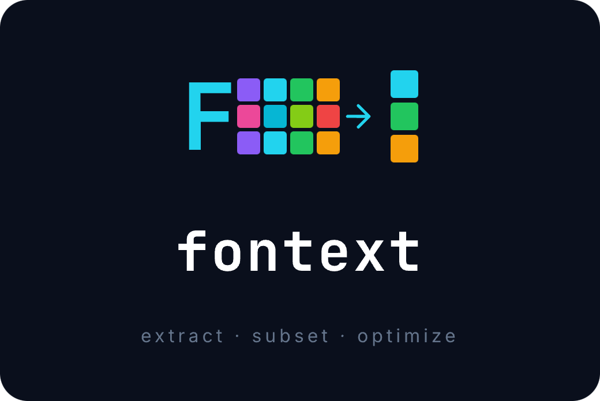

<p align="center">
  
</p>

<p align="center">
  <a href="https://www.npmjs.com/package/fontext"></a>
  <a href="./LICENSE"></a>
  <a href="./package.json"></a>
</p>

Extract glyphs from fonts and generate optimized, minimal font files.

Two engines for different use cases:

- **Icon engine** — extract glyphs from ligature-based icon fonts (Material Icons, etc.)
- **Subset engine** — subset any font by characters or unicode ranges, preserving kerning and OpenType features

## Why Fontext?

Icon fonts often contain 1000+ glyphs. Text fonts ship entire alphabets when you only need a subset. Fontext solves
both:

- **Extract by ligature** — pass ligature names like `"home"`, `"search"`, `"menu"` (icon engine)
- **Extract by raw unicode** — pass the actual unicode character and Fontext resolves the ligature automatically (icon
  engine)
- **Subset by characters** — pass `"ABCabc0123"` to keep only those characters (subset engine)
- **Subset by unicode range** — pass `U+0400-U+04FF` for Cyrillic block (both engines)
- **Multiple output formats** — SVG, TTF, WOFF, WOFF2, EOT
- **Preserves font features** — subset engine keeps kerning, hinting, GSUB/GPOS via HarfBuzz
- **Glyph metadata** — get name, unicode mappings, and SVG path data for each extracted glyph

## Installation

```bash
npm install fontext
```

## CLI

```bash
npx fontext -i material-icons.woff2 -n my-icons -l home,search,menu -f woff2,ttf -o ./fonts
```

| Flag                    | Description                                             |
|-------------------------|---------------------------------------------------------|
| `-i, --input`           | Path to the font file (required)                        |
| `-n, --font-name`       | Name for the output font (required)                     |
| `-l, --ligatures`       | Comma-separated ligature names                          |
| `-r, --raws`            | Comma-separated raw unicode characters                  |
| `-u, --unicode-ranges`  | Comma-separated unicode ranges (e.g. `U+E000-U+E100`)   |
| `-f, --formats`         | Output formats: `svg,ttf,woff,woff2,eot` (default: all) |
| `-o, --output`          | Output directory (default: `.`)                         |
| `-w, --with-whitespace` | Include whitespace glyph                                |

## Quick Start

```javascript
import {extract} from 'fontext';
import fs from 'fs';

const font = fs.readFileSync('material-icons.woff2');

const result = await extract(font, {
    fontName: 'my-icons',
    ligatures: ['home', 'search', 'menu'],
    formats: ['woff2', 'ttf'],
});

// result.woff2 — Buffer with optimized WOFF2 font
// result.ttf  — Buffer with optimized TTF font
// result.meta — glyph metadata (name, unicode, svg)

fs.writeFileSync('my-icons.woff2', result.woff2);
```

## API

### `extract(content, options): Promise<ExtractedResult>`

| Parameter | Type           | Description                                                         |
|-----------|----------------|---------------------------------------------------------------------|
| `content` | `Buffer`       | Font file contents (TTF, WOFF2, or any format supported by fontkit) |
| `options` | `MinifyOption` | Extraction configuration (see below)                                |

### `MinifyOption`

| Field            | Type        | Default     | Description                                                                 |
|------------------|-------------|-------------|-----------------------------------------------------------------------------|
| `fontName`       | `string`    | —           | **Required.** Name for the output font                                      |
| `ligatures`      | `string[]`  | `[]`        | Ligature strings to extract (e.g. `['home', 'search']`)                     |
| `raws`           | `string[]`  | `[]`        | Raw unicode characters — Fontext will resolve their ligatures automatically |
| `unicodeRanges`  | `string[]`  | `[]`        | Unicode ranges to extract (e.g. `['U+E000-U+E100', 'U+F000']`)              |
| `characters`     | `string`    | —           | Characters to keep (e.g. `'ABCabc0123'`) — subset engine only               |
| `engine`         | `Engine`    | `'icon'`    | `'icon'` for ligature fonts, `'subset'` for text fonts (preserves kerning)  |
| `formats`        | `Formats[]` | all formats | Output formats: `'svg'`, `'ttf'`, `'woff'`, `'woff2'`, `'eot'`              |
| `withWhitespace` | `boolean`   | `false`     | Include whitespace glyph in the output                                      |

> At least one of `ligatures`, `raws`, `unicodeRanges`, or `characters` must be provided.

### Error Handling

`extract()` throws in the following cases:

- Missing or empty `fontName`, `ligatures`/`raws`, or `formats` — `"Illegal option"`
- Font lacks a GSUB ligature lookup table (required for `raws`) — `"Font does not contain a GSUB ligature lookup table"`
- A raw unicode character has no matching ligature — `"Font does not contain a ligature for \"...\""`

### `ExtractedResult`

An object with optional keys for each requested format (`svg`, `ttf`, `woff`, `woff2`, `eot`), each containing a
`Buffer`. Also includes `meta` and `report`:

```typescript
interface GlyphMeta {
    name: string;      // ligature name
    unicode: string[];  // unicode mappings
    svg: string;        // SVG markup for the glyph
}

interface OptimizationReport {
    originalSize: number;  // input font size in bytes
    formats: {
        [format: string]: {
            size: number;    // output size in bytes
            saving: number;  // percentage saved (0-100)
        };
    };
}
```

## Supported Input Formats

Single font files supported by [fontkit](https://github.com/foliojs/fontkit): TTF, OTF, WOFF, WOFF2. Font collections (
TTC, DFONT) are not supported.

## Browser Usage

A browser-compatible entry point is available for glyph discovery and SVG extraction (without format conversion):

```javascript
import {createFont, findMetaByLigatures, findMetaByCodePoints, parseUnicodeRanges} from 'fontext/browser';

const response = await fetch('/fonts/icons.woff2');
const data = new Uint8Array(await response.arrayBuffer());

const font = createFont(data);
const meta = findMetaByLigatures(font, ['home', 'search']);
// meta[0].svg — SVG markup for the glyph
```

## License

[MIT](./LICENSE)
