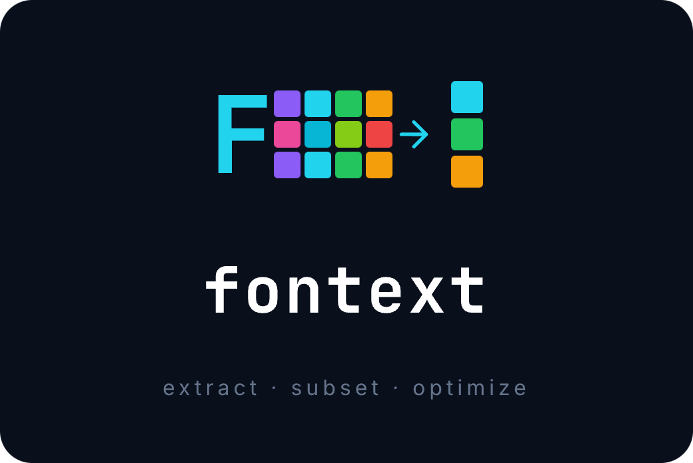

<p align="center">
  
</p>

<p align="center">
  <a href="https://www.npmjs.com/package/fontext"></a>
  <a href="./LICENSE"></a>
  <a href="./package.json"></a>
  <a href="https://codecov.io/gh/a3mitskevich/fontext"></a>
</p>

Extract glyphs from fonts and generate optimized, minimal font files.

Two engines for different use cases:

- **Icon engine** — extract glyphs from ligature-based icon fonts (Material Icons, etc.)
- **Subset engine** — subset any font by characters or unicode ranges, preserving kerning and OpenType features

## Why Fontext?

Icon fonts often contain 1000+ glyphs. Text fonts ship entire alphabets when you only need a subset. Fontext solves
both:

- **Extract by ligature** — pass ligature names like `"home"`, `"search"`, `"menu"` (icon engine)
- **Extract by raw unicode** — pass the actual unicode character and Fontext resolves the ligature automatically (icon
  engine)
- **Subset by characters** — pass `"ABCabc0123"` to keep only those characters (subset engine)
- **Subset by unicode range** — pass `U+0400-U+04FF` for Cyrillic block (both engines)
- **Multiple output formats** — SVG, TTF, WOFF, WOFF2, EOT
- **Preserves font features** — subset engine keeps kerning, hinting, GSUB/GPOS via HarfBuzz
- **Glyph metadata** — get name, unicode mappings, and SVG path data for each extracted glyph
- **Reproducible output** — identical input produces byte-identical fonts, so content-hashed asset names stay stable
  between builds

## Installation

```bash
npm install fontext
```

Requires Node.js 22.13 or later. The package is ESM only; CommonJS code can still load it with
`require("fontext")`, which Node supports for ES modules since 22.13 without warnings.

## CLI

```bash
npx fontext -i material-icons.woff2 -n my-icons -l home,search,menu -f woff2,ttf -o ./fonts
```

| Flag                    | Description                                             |
|-------------------------|---------------------------------------------------------|
| `-i, --input`           | Path to the font file (required)                        |
| `-n, --font-name`       | Name for the output font (required)                     |
| `-l, --ligatures`       | Comma-separated ligature names                          |
| `-r, --raws`            | Comma-separated raw unicode characters                  |
| `-u, --unicode-ranges`  | Comma-separated unicode ranges (e.g. `U+E000-U+E100`)   |
| `-f, --formats`         | Output formats: `svg,ttf,woff,woff2,eot` (default: all) |
| `-o, --output`          | Output directory (default: `.`)                         |
| `-w, --with-whitespace` | Include whitespace glyph                                |

## Quick Start

```javascript
import {extract} from 'fontext';
import fs from 'fs';

const font = fs.readFileSync('material-icons.woff2');

const result = await extract(font, {
    fontName: 'my-icons',
    ligatures: ['home', 'search', 'menu'],
    formats: ['woff2', 'ttf'],
});

// result.woff2 — Buffer with optimized WOFF2 font
// result.ttf  — Buffer with optimized TTF font
// result.meta — glyph metadata (name, unicode, svg)

fs.writeFileSync('my-icons.woff2', result.woff2);
```

## API

### `extract(content, options): Promise<ExtractedResult>`

| Parameter | Type           | Description                                                         |
|-----------|----------------|---------------------------------------------------------------------|
| `content` | `Buffer \| Uint8Array \| ArrayBuffer` | Font file contents: TTF, OTF, WOFF or WOFF2                        |
| `options` | `MinifyOption` | Extraction configuration (see below)                                |

### `MinifyOption`

| Field            | Type        | Default     | Description                                                                 |
|------------------|-------------|-------------|-----------------------------------------------------------------------------|
| `fontName`       | `string`    | —           | **Required.** Name for the output font                                      |
| `ligatures`      | `string[]`  | `[]`        | Ligature strings to extract (e.g. `['home', 'search']`)                     |
| `raws`           | `string[]`  | `[]`        | Raw unicode characters — Fontext will resolve their ligatures automatically |
| `unicodeRanges`  | `string[]`  | `[]`        | Unicode ranges to extract (e.g. `['U+E000-U+E100', 'U+F000']`)              |
| `characters`     | `string`    | —           | Characters to keep (e.g. `'ABCabc0123'`) — subset engine only               |
| `engine`         | `Engine`    | `'icon'`    | `'icon'` for ligature fonts, `'subset'` for text fonts (preserves kerning), `'convert'` to change format only |
| `formats`        | `Formats[]` | all formats | Output formats: `'svg'`, `'ttf'`, `'woff'`, `'woff2'`, `'eot'`              |
| `withWhitespace` | `boolean`   | `false`     | Include whitespace glyph in the output                                      |

> At least one of `ligatures`, `raws`, `unicodeRanges`, or `characters` must be provided.

### Error Handling

`extract()` throws in the following cases:

- Font input is not a `Buffer`, `Uint8Array` or `ArrayBuffer` — `TypeError: "Font input must be a Buffer, Uint8Array or ArrayBuffer"`
- Font data is not TTF, OTF, WOFF or WOFF2 — `"Unsupported font format: ..."`
- Font is a collection (TTC, DFONT) — `"Font collections (TTC/DFONT) are not supported. Provide a single font file."`
- Font tables are damaged — `"Malformed GSUB table: ..."`, `"Malformed WOFF file: ..."` and similar, naming the table and offset
- Missing `fontName` — `"fontName is required"`
- No glyph selection for the icon or subset engine —
  `"At least one of ligatures, raws, unicodeRanges, or characters must be provided"`
- Empty or unknown `formats` — `"At least one output format must be specified"` / `"Invalid format(s): ..."`
- Font lacks a GSUB ligature lookup table (required for `raws`) — `"Font does not contain a GSUB ligature lookup table"`
- A raw unicode character has no matching ligature — `"Font does not contain a ligature for \"...\""`

### `ExtractedResult`

An object with optional keys for each requested format (`svg`, `ttf`, `woff`, `woff2`, `eot`), each containing a
`Buffer`. Also includes `meta` and `report`:

```typescript
interface GlyphMeta {
    name: string;      // ligature name
    unicode: string[];  // unicode mappings
    svg: string;        // SVG markup for the glyph
}

interface OptimizationReport {
    originalSize: number;  // input font size in bytes
    formats: {
        [format: string]: {
            size: number;    // output size in bytes
            saving: number;  // percentage saved (0-100)
        };
    };
}
```

## Supported Input Formats

Single TrueType and OpenType fonts (TTF, OTF with CFF outlines), WOFF and WOFF2. Fonts are read with
[HarfBuzz](https://github.com/harfbuzz/harfbuzzjs), which also lays out the ligatures. Font collections (TTC, DFONT)
are not supported.

## Browser Usage (experimental)

A browser entry point finds glyphs and their SVG outlines without Node.js APIs or format conversion. It reads TTF, OTF
and WOFF; WOFF2 is rejected with an error, so decode it first or use the Node entry, which reads WOFF2.

```javascript
import {createFont, findMetaByLigatures, findLigaturesByRaws} from 'fontext/browser';

const response = await fetch('/fonts/icons.woff');
const data = new Uint8Array(await response.arrayBuffer());

const font = await createFont(data);
const meta = findMetaByLigatures(font, ['home', 'search']);
// meta[0].svg — SVG markup for the glyph
const ligatures = await findLigaturesByRaws(data, ['\uE88A']);
```

HarfBuzz runs as WebAssembly (`harfbuzz.wasm`, about 430 KB, 180 KB gzipped). It is loaded on the first
`createFont()` call from a URL relative to the module (`new URL(..., import.meta.url)`), and the module uses top-level
await, so the bundler has to keep both:

- **Vite** works with the default config. In a Web Worker set `worker: { format: 'es' }`.
- **webpack 5** needs `resolve: { fallback: { module: false } }`.
- A Content Security Policy must allow `'wasm-unsafe-eval'` in `script-src`, and `.wasm` files must be served as
  `application/wasm`.

## License

[MIT](./LICENSE)
