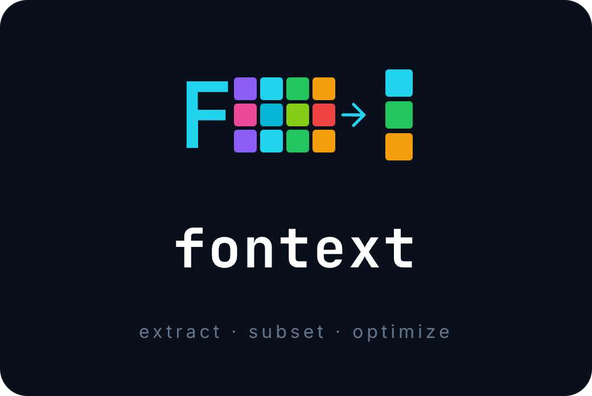

<p align="center">
  
</p>

<p align="center">
  <a href="https://www.npmjs.com/package/fontext"></a>
  <a href="./LICENSE"></a>
  <a href="./package.json"></a>
  <a href="https://codecov.io/gh/a3mitskevich/fontext"></a>
</p>

Extract glyphs from fonts and generate optimized, minimal font files.

Two engines for different use cases:

- **Icon engine** — extract glyphs from ligature-based icon fonts (Material Icons, etc.)
- **Subset engine** — subset any font by characters, unicode ranges or ligatures, preserving kerning and OpenType
  features

## Why Fontext?

Icon fonts often contain 1000+ glyphs. Text fonts ship entire alphabets when you only need a subset. Fontext solves
both:

- **Extract by ligature** — pass ligature names like `"home"`, `"search"`, `"menu"` (icon engine)
- **Extract by raw unicode** — pass the actual unicode character and Fontext resolves the ligature automatically (icon
  engine)
- **Subset by characters** — pass `"ABCabc0123"` to keep only those characters (subset engine)
- **Subset by unicode range** — pass `U+0400-U+04FF` for Cyrillic block (both engines)
- **Subset by ligature** — pass `"home"` to keep that icon of a ligature icon font with every OpenType table (subset
  engine); only the requested ligatures form, not the others their letters could spell
- **Multiple output formats** — SVG, TTF, WOFF, WOFF2, EOT
- **Preserves font features** — subset engine keeps kerning, hinting, GSUB/GPOS via HarfBuzz; pairs of a legacy
  `kern` table are kept only for the glyphs that stay in the font, and `warnings` tells when some of it can't be kept
- **Glyph metadata** — get name, unicode mappings, and SVG path data for each extracted glyph
- **Reproducible output** — identical input produces byte-identical fonts, so content-hashed asset names stay stable
  between builds
- **Targets** — `target: "web"` or `"runtime"` trims hinting, layout features and names for browsers or for 3D and
  animation runtimes that load TTF directly (see [Targets and optimization options](#targets-and-optimization-options))

## Installation

```bash
npm install fontext
```

Requires Node.js 22.13 or later. The package is ESM only; CommonJS code can still load it with
`require("fontext")`, which Node supports for ES modules since 22.13 without warnings.

## CLI

```bash
npx fontext -i material-icons.woff2 -n my-icons -l home,search,menu -f woff2,ttf -o ./fonts
```

| Flag                    | Description                                             |
|-------------------------|---------------------------------------------------------|
| `-i, --input`           | Path to the font file (required)                        |
| `-n, --font-name`       | Name for the output font (required)                     |
| `-l, --ligatures`       | Comma-separated ligature names                          |
| `-r, --raws`            | Comma-separated raw unicode characters                  |
| `-u, --unicode-ranges`  | Comma-separated unicode ranges (e.g. `U+E000-U+E100`)   |
| `-f, --formats`         | Output formats: `svg,ttf,woff,woff2,eot` (default: all) |
| `-o, --output`          | Output directory (default: `.`)                         |
| `--target`              | `web` or `runtime`                                        |
| `--no-hinting`          | Drop TrueType hinting (`--hinting` keeps it)             |
| `--layout-features`     | `all`, `default` or tags: `liga,kern`                    |
| `--name-ids`            | Name ids to keep: `1,2,4`                                |
| `--drop-tables`         | Tables to drop: `MATH,DSIG`                              |

`.fontextrc.json` and its batch entries take the same options as `target`, `hinting`, `layoutFeatures`, `nameIds`
and `dropTables`. `fontext --help` lists every flag.

## Quick Start

```javascript
import {extract} from 'fontext';
import fs from 'fs';

const font = fs.readFileSync('material-icons.woff2');

const result = await extract(font, {
    fontName: 'my-icons',
    ligatures: ['home', 'search', 'menu'],
    formats: ['woff2', 'ttf'],
});

// result.woff2 — Buffer with optimized WOFF2 font
// result.ttf  — Buffer with optimized TTF font
// result.meta — glyph metadata (name, unicode, svg)

fs.writeFileSync('my-icons.woff2', result.woff2);
```

## API

### `extract(content, options): Promise<ExtractedResult>`

| Parameter | Type           | Description                                                         |
|-----------|----------------|---------------------------------------------------------------------|
| `content` | `Buffer \| Uint8Array \| ArrayBuffer` | Font file contents: TTF, OTF, WOFF or WOFF2                        |
| `options` | `MinifyOption` | Extraction configuration (see below)                                |

### `MinifyOption`

| Field            | Type        | Default     | Description                                                                 |
|------------------|-------------|-------------|-----------------------------------------------------------------------------|
| `fontName`       | `string`    | —           | **Required.** Name for the output font                                      |
| `ligatures`      | `string[]`  | `[]`        | Ligature strings to extract (e.g. `['home', 'search']`); the subset engine keeps each with its letters, and characters and unicode ranges keep the ligatures they form |
| `raws`           | `string[]`  | `[]`        | Raw unicode characters — Fontext will resolve their ligatures automatically |
| `unicodeRanges`  | `string[]`  | `[]`        | Unicode ranges to extract (e.g. `['U+E000-U+E100', 'U+F000']`)              |
| `characters`     | `string`    | —           | Characters to keep (e.g. `'ABCabc0123'`) — subset engine only               |
| `engine`         | `Engine`    | `'icon'`    | `'icon'` for ligature fonts, `'subset'` for text fonts (preserves kerning), `'convert'` to change format only |
| `formats`        | `Formats[]` | all formats | Output formats: `'svg'`, `'ttf'`, `'woff'`, `'woff2'`, `'eot'`; the subset engine defaults to TTF, WOFF and WOFF2, a `target` to its own |
| `safariFix`      | `boolean`   | `false`     | Patch OS/2 and hhea metrics for Safari                                      |
| `target`         | `Target`    | —           | `'web'` or `'runtime'`, see [Targets and optimization options](#targets-and-optimization-options) |
| `hinting`        | `boolean`   | `true`      | Keep TrueType hinting — subset and convert engines                         |
| `layoutFeatures` | `LayoutFeatures` | `'all'` | `'all'`, `'default'` (HarfBuzz's default set) or feature tags — subset and convert engines |
| `nameIds`        | `number[]`  | 0–6 (icon: 1, 2, 4, 6) | Name ids to keep                                                 |
| `dropTables`     | `string[]`  | `[]`        | Tags of tables to drop                                                      |
| `transform`      | `FontTransform` | —       | `(ttf: Uint8Array) => Uint8Array \| Promise<Uint8Array>`, rewrites the final TTF before encoding |

> At least one of `ligatures`, `raws`, `unicodeRanges`, or `characters` must be provided.

### Error Handling

`extract()` returns a rejected promise, never a synchronous throw, in the following cases:

- Font input is not a `Buffer`, `Uint8Array` or `ArrayBuffer` — `TypeError: "Font input must be a Buffer, Uint8Array or ArrayBuffer"`
- Font data is not TTF, OTF, WOFF or WOFF2 — `"Unsupported font format: ..."`
- Font is a collection (TTC, DFONT) — `"Font collections (TTC/DFONT) are not supported. Provide a single font file."`
- Font tables are damaged, or the file is cut short so that a table needed to read glyphs runs past its end — `"Malformed GSUB table: ..."`, `"Malformed glyf table: ..."`, `"Malformed WOFF file: ..."` and similar, naming the table and offset
- Missing `fontName` — `"fontName is required"`
- No glyph selection for the icon or subset engine —
  `"At least one of ligatures, raws, unicodeRanges, or characters must be provided"`
- Empty or unknown `formats` — `"At least one output format must be specified"` / `"Invalid format(s): ..."`
- Font lacks a GSUB ligature lookup table (required for `raws`) — `"Font does not contain a GSUB ligature lookup table"`
- A raw unicode character has no matching ligature, or an icon engine ligature doesn't form a single glyph (an
  unknown name or a typo would otherwise give the glyphs of its letters) — `"Font does not contain a ligature for \"...\""`
- The icon engine selection matches no glyph, e.g. unicode ranges the font maps none of —
  `"No glyphs match the selection: the font maps none of unicodeRanges ..."`
- An unknown `target`, a `hinting` that is not a boolean, a `layoutFeatures` keyword other than `all` / `default`,
  a name id that is not an integer from 0 to 32767, or a tag that is not 1–4 printable ASCII characters —
  `"Invalid target: ..."`, `"Invalid name id(s): ..."`, `"Invalid tag(s) in dropTables: ..."` and similar; a
  `dropTables` tag of a table every font needs — `"Invalid tag(s) in dropTables: \"head\". The font needs these tables: ..."`
- `transform` throws or rejects — `"transform failed: ..."` with the original error as `cause`; it returns WOFF,
  WOFF2, a collection or no font — `"transform must return an uncompressed TrueType or OpenType font, not WOFF2"` and
  similar

### `ExtractedResult`

An object with optional keys for each requested format (`svg`, `ttf`, `woff`, `woff2`, `eot`), each containing a
`Buffer`. Also includes `meta`, `report` and `warnings`:

```typescript
interface GlyphMeta {
    name: string;      // ligature name
    unicode: string[];  // unicode mappings
    svg: string;        // SVG markup for the glyph
}

interface OptimizationReport {
    originalSize: number;  // input font size in bytes
    formats: {
        [format: string]: {
            size: number;    // output size in bytes
            saving: number;  // percentage saved, negative when the output is larger
        };
    };
}

interface FontWarning {
    code: "legacy-kern";  // what the output could not keep
    message: string;
}
```

`warnings` lists what the subset and convert engines could not keep from the source font; the CLI prints them
(and puts them in `--json` output). `legacy-kern`: the font kerns only in the legacy `kern` table, and part of it was
left out — an Apple or malformed table, format 2/3, cross-stream or vertical subtables, or pairs of glyphs without a
code point that could not be matched in the subset. A version of the font with kerning in GPOS avoids it.

### Icon engine output

The icon engine builds a new font from the extracted glyphs. Each glyph is scaled so that its vertical advance fills
the em, which is the source font's units per em: a glyph as tall as the em keeps its coordinates. An em below 512
units is multiplied up to at least 512, since outlines are rounded to whole units, and an em at which a very wide glyph
would overflow TrueType coordinates is lowered. Ligatures are `liga` ligatures under the `DFLT` and `latn` scripts. The
font keeps only the family, subfamily, full and PostScript names (Windows, English) and has no glyph names in its
`post` table: `meta` gives the name of each glyph.

### Targets and optimization options

Fonts go to browsers, and to runtimes that load a TTF directly and draw its outlines as vector paths or SDF: Rive
(TTF/OTF through HarfBuzz), three.js `TTFLoader` and opentype.js, troika-three-text (TTF, OTF, WOFF, no WOFF2). None
of those runtimes use hinting. `target` picks defaults for either:

| `target`    | Formats | Hinting | Layout features | Name ids   | CFF             |
|-------------|---------|---------|-----------------|------------|-----------------|
| none        | all (subset: TTF, WOFF, WOFF2) | kept | all | 0–6 (icon: 1, 2, 4, 6) | kept as is |
| `'web'`     | WOFF2   | kept    | HarfBuzz default | 1, 2, 4, 6 | desubroutinized |
| `'runtime'` | TTF     | dropped | HarfBuzz default | 1, 2, 4, 6 | kept as is      |

Explicit `formats`, `hinting`, `layoutFeatures`, `nameIds` and `dropTables` override the target. Without a target
and these options the output is what it was before they existed.

- **Hinting** is most of a hinted TrueType font: Latin and Cyrillic of Liberation Sans take 53 840 → 20 496 bytes as
  TTF (WOFF2 32 272 → 11 224), DejaVu 38 832 → 22 256. `hinting: false` drops `fpgm`, `prep`, `cvt `, `hdmx`,
  `VDMX` and the glyph instructions; outlines stay the same.
- **Layout features**: HarfBuzz's default set (`liga`, `rlig`, `calt`, `kern`, `mark`, script features and so on)
  is what troika, opentype.js and Rive apply, and browsers apply it unless CSS asks for more. Dropping the other
  features takes DejaVu's WOFF2 9 984 → 8 892 bytes. Glyphs only an optional feature such as `dlig` reaches are
  left out too.
- **Name ids** 1, 2, 4 and 6 are family, subfamily, full name (three.js `TTFLoader` reads it) and PostScript name; the
  rest saves a few hundred bytes.
- **CFF desubroutinization** helps WOFF2 (13 860 → 13 392 bytes) but grows a raw OTF (27 376 → 33 872), so only the
  web target does it.

Tags of `layoutFeatures` and `dropTables` are 1–4 printable ASCII characters; shorter ones are padded with spaces, so
`"cvt"` is the `cvt ` table. `dropTables` rejects the tables every font needs — those browsers require (`cmap`,
`head`, `hhea`, `hmtx`, `maxp`, `name`, `OS/2`, `post`) and the outlines (`glyf`, `loca`, `CFF`, `CFF2`).
Dropping `kern` also keeps the subset and convert engines from putting the legacy kern pairs back.

Per engine: the subset and convert engines take every option. The icon engine takes `target`, `nameIds`,
`dropTables` and `transform`; its font comes from SVG outlines, so it has no hinting, and its one `liga` feature is
what forms the icons: `hinting` and `layoutFeatures` are not part of its options type and are ignored if given. The
`svg` format is not affected by any of these options.

`transform` receives the final font once — after the legacy `kern` table is restored and the Safari fix applied,
before encoding — and what it returns is encoded into every binary format. It must return an uncompressed TrueType or
OpenType font. The subset and convert engines read `meta` from the transformed font. It is not called when only `svg`
is requested:

```javascript
const result = await extract(font, {
    fontName: 'roboto-3d',
    engine: 'subset',
    characters: 'ABCabc0123',
    target: 'runtime',
    // e.g. run the font through another tool that takes and returns TTF bytes
    transform: async (ttf) => myFontTool(ttf),
});

fs.writeFileSync('roboto-3d.ttf', result.ttf);
```

## Supported Input Formats

Single TrueType and OpenType fonts (TTF, OTF with CFF outlines), WOFF and WOFF2. Fonts are read with
[HarfBuzz](https://github.com/harfbuzz/harfbuzzjs), which also lays out the ligatures. Font collections (TTC, DFONT)
are not supported.

## Browser Usage (experimental)

A browser entry point finds glyphs and their SVG outlines without Node.js APIs or format conversion. It reads TTF, OTF
and WOFF; WOFF2 is rejected with an error, so decode it first or use the Node entry, which reads WOFF2.

```javascript
import {createFont, findMetaByLigatures, findLigaturesByRaws} from 'fontext/browser';

const response = await fetch('/fonts/icons.woff');
const data = new Uint8Array(await response.arrayBuffer());

const font = await createFont(data);
const meta = findMetaByLigatures(font, ['home', 'search']);
// meta[0].svg — SVG markup for the glyph
const ligatures = await findLigaturesByRaws(data, ['\uE88A']);
```

`findMetaByLigatures()` returns the glyphs the text is laid out to: a text that forms no ligature gives the glyphs of
its letters. `extract()` rejects such ligatures instead.

HarfBuzz runs as WebAssembly (`harfbuzz.wasm`, about 430 KB, 180 KB gzipped). It is loaded on the first
`createFont()` call from a URL relative to the module (`new URL(..., import.meta.url)`), and the module uses top-level
await, so the bundler has to keep both:

- **Vite** works with the default config. In a Web Worker set `worker: { format: 'es' }`.
- **webpack 5** needs `resolve: { fallback: { module: false } }`.
- A Content Security Policy must allow `'wasm-unsafe-eval'` in `script-src`, and `.wasm` files must be served as
  `application/wasm`.

## Development

`npm test` runs the Vitest suite. The browser checks render the output of every engine and format and compare it
with the source font pixel by pixel, one browser per script:

- `npm run test:e2e:safari` — the installed Safari, through `safaridriver`. Once per Mac: Safari > Settings >
  Advanced > "Show features for web developers", then Settings > Developer > "Allow remote automation".
- `npm run test:e2e:chrome` — the installed Google Chrome, through Playwright.
- `npm run test:e2e:firefox` — Playwright's Firefox; run `npx playwright install firefox` once.

`npm run test:e2e:manual` serves the same checks at http://localhost:4178 to open in any browser.

## License

[MIT](./LICENSE)
